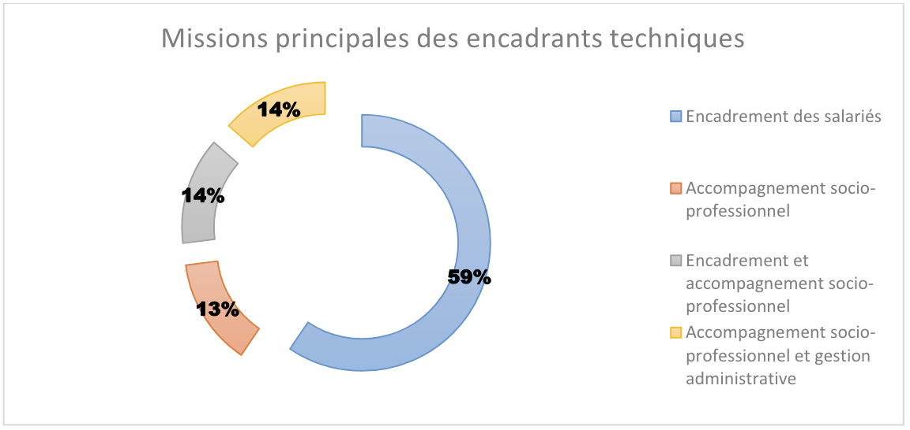

# Hackathon DSN 
## S_SP_NS_ _N

Dépôt pour le Hackathon DSN organisé par la Direction interministérielle du numérique.
### 

**Description**

- *Problématique et proposition de valeur.*
    - L'insertion par l'activité économique (IAE) est un dispositif visant à aider les personnes éloignées du marché du travail à retrouver une activité professionnelle durable. Ce concept repose sur la création d'emplois dans des structures spécialisées (SIAE), telles que les entreprises d'insertion, les ateliers et chantiers d'insertion, et les associations intermédiaires. Ces structures offrent un accompagnement personnalisé et des formations adaptées pour développer les compétences et l'employabilité des individus. L'objectif est de faciliter leur transition vers un emploi stable et de contribuer à leur inclusion sociale en leur permettant de participer pleinement à la vie économique.
    - En contrepartie des efforts consenties par les SIAE pour accompagner les personnes des aides au poste sont versées mensuellement. Pour obtenir ces aides les SIAE doivent réaliser des actes administratifs sur les emplois de l’inclusion (délivrance d’un PASS IAE pour chaque personne) et sur l’extranet 2.0 IAE de l’Agence de Service et de Paiement (saisie mensuelle des données de paie)
    - Cette charge administrative a pu être quantifiée dans une étude réalisée par la DREETS Grand Est en 2021 auprès des encadrants des SIAE : 14% du temps y est consacré !
        
        
        
- *A quelle problématique s’attaque votre projet ?*
    - Le PASS IAE est attribué pour une durée initiale de deux ans, renouvelable sous certaines conditions. Il garantit que la personne concernée recevra un soutien adapté à ses besoins pour améliorer ses compétences, résoudre les obstacles à l'emploi et progresser vers un travail durable. Le dispositif assure également un lien entre les différentes parties prenantes (employeurs, conseillers d'insertion, services sociaux) pour un suivi cohérent et efficace du parcours d'insertion.
    - Des suspensions de parcours sont possible dans plusieurs cas, comme une reprise d'emploi en dehors du cadre de l'IAE, une formation longue durée, ou des motifs personnels comme des raisons de santé. La suspension permet de mettre en pause le parcours d'insertion sans perdre les droits acquis, facilitant ainsi une reprise du PASS IAE ultérieurement. Cette flexibilité est essentielle pour s'adapter aux parcours de vie souvent complexes des bénéficiaires de l'IAE. Le suivi reste coordonné entre les différents acteurs pour assurer une reprise efficace et adaptée du parcours d'insertion lorsque la personne est prête.
    - La suspension est déclarée à la discrétion de l’employeur sur les emplois de l’inclusion. Ainsi pour une même situation une SIAE peut suspendre le PASS IAE ou non. De fait il peut y avoir une inégalité de traitement pour les personnes.

- *Quelle est votre proposition de valeur ?*
    - En utilisant les informations sur le temps de travail déclaré chaque mois nous serons capable de mettre à jour un compteur de droit à travailler dans l'Insertion par l'Activité Economique. Cela permettra notamment de garantir une égalité de traitement de personnes et de libérer les SIAE d’une contrainte administrative au profit de l’accompagnement. Ce dernier point est également confirmé dans l’étude de la DREETS.
        
        
        

**Solution**

- *Description de la solution et de ses fonctionnalités*
    - Chaque mois les emplois de l’inclusion interroge la DSN afin de récupérer le volume d’heure travaillé. Cela permettra aux employeurs et salariés de connaître le temps de travail restant à consommer dans le cadre de l’IAE.
    - Par ailleurs la mise en évidence des périodes non travaillé permettra d’éviter les ruptures d’accompagnement et d’orienter plus rapidement les personnes vers un nouvel accompagnement dans le nouveau cadre de la loi Plein Emploi.
    - La récupération via la DSN des arrêts de travail et des suspensions de contrat ainsi que de leurs durée et motif permet de donner à l’employeur une visibilité plus complète de la situation du candidat et d’expliquer les périodes non travaillées.
- *Quel usage est fait des données ? Que vous permettent-elles de faire ?*
    - La DSN nous permet d’accéder au volume de temps travaillé. Les SIAE étant obligatoirement conventionnées nous n’aurons pas de problème d’identification des établissement grâce au SIRET. Les emplois de l’inclusion ayant un droit d’usage du NIR nous n’aurons pas de difficultés d’identification des salariés à requêter chaque mois. Seul les personnes titulaires d’un PASS IAE seront requêter.
    - En exploitant le volume de travail nous pourrons supprimer la saisie manuelle des suspensions au profit d’un décompte automatique basé sur ce volume .
- *Quelle est la méthode de création de la solution ?*
    - Dans le cadre du hackathon :
        - création d’une table qui contient pour chaque salarié et l’ensemble des activités rémunérées avec le nombre d’heures associées, la période (date de début de paie, date de fin de paye), et la structure associée. Cette table permet ensuite d’intégrer au site des emplois de l’inclusion le nombre d’heures travaillées pour un salarié donné.
        - création d’une table qui contient l’identifiant du salarié et l’ensemble de ses suspensions de contrat, avec le motif de la suspension, la période (date de début et date de fin), et la structure associée. Cette table permet d’intégrer la liste des suspensions pour un salarié.

**Impact envisagé**

- *Que permet de faire la solution ?*
    - Cela permet de libérer 10% du temps des encadrants passé à la gestion administrative. On passerai de 20 heures par mois de gestion à 18h par mois. Au global ce sera près de 150 000 heures de libérée par an.
    - Boucle de rétroaction positive : les IAE deviendront conscientes de l’impact que peuvent avoir les données si elles sont bien renseignées, et pourraient donc devenir plus rigoureuses dans leur remplissage des tables, ce qui contribuera à améliorer encore d’avantage leur expérience.
    - Valorisation des données DSN : outre le fait d’améliorer un outil grâce à cette donnée, elle pourra également être valorisée et diffusée dans le cadre d’analyses réalisées par le pilotage de l’inclusion. Ce produit diffuse notamment différentes analyses autour l’IAE et se base pour se faire en grande partie sur les données qui transitent via les emplois de l’inclusion. Par exemple, une récente étude sur la place des femme dans l’IAE pourrait être enrichie de cette donnée, en étudiant par exemple si les parcours en IAE chez les femmes sont plus interrompus que chez les hommes, ce qui permet à minima de faire connaître la situation, et au mieux d’en faire découler les actions ou politiques permettant de mieux accompagner ces publics.
- *Qui sont les usagers visés, et qu’en feraient-ils ?*
    - Les 6014 structures d’Insertion par l’Activité Economique pour leur permettre 1) un gain de temps dans le traitement du suivi de leurs salariés, et 2) un meilleur accompagnement de leur salariés.
    - Les 421666 bénéficiaires de l’IAE pour leur permettre d’avoir de la visibilité sur parcours.

**Ressources**

- *Lien vers la documentation du projet*

### [Facultatif] Retours sur la qualité des données exploitées

* *Quelles sont les difficultés que vous avez rencontrées dans l’usage des données ?*
